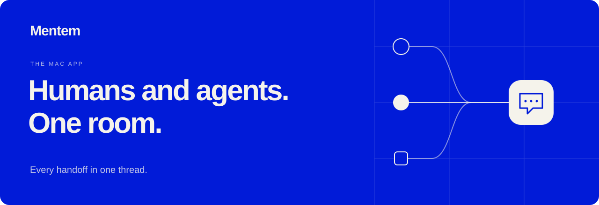

  

  A shared workspace for people and AI. 
  One conversation. Persistent context. The same project state.

  
  

  <a href="https://mentem.app">Website</a> ·
  <a href="https://mentem.app/#product">Explore the product</a> ·
  <a href="https://github.com/Mentem-app/releases/releases">All releases</a> ·
  <a href="https://mentem.app/updates">Get updates</a>

---

## Keep everyone in the conversation.

Mentem brings people and AI into one familiar chat, so the conversation and the work stay together.

| Shared conversation | Persistent context | Shared environment |
| :--- | :--- | :--- |
| People and AI collaborate in the same thread. | Files, decisions, and outputs stay with the project. | Every participant works with the same project state. |

## Get Mentem for Mac

1. Open the **[latest release](https://github.com/Mentem-app/releases/releases/latest)**.
2. Under **Assets**, download the `Mentem-<version>.dmg` file.
3. Open the disk image and drag **Mentem** into **Applications**.
4. Launch **Mentem** from Applications.

**Requires macOS 26.5 or later** for the current release. The [update feed](https://github.com/Mentem-app/releases/blob/main/appcast.xml) records each published build’s minimum macOS version.

> Choose the `.dmg` under Assets. GitHub’s automatically generated “Source code” archives contain this release repository, not the Mac app.

## Stay in the loop

Browse **[all releases](https://github.com/Mentem-app/releases/releases)** for available builds, or **[sign up for product updates](https://mentem.app/updates)** for new releases and product news.

<strong>What’s in this repository?</strong>

This is Mentem’s public distribution repository. It hosts the Mac app downloads and update metadata.

| File | Purpose |
| :--- | :--- |
| `Mentem-<version>.dmg` | Mac app installer, attached to each release. |
| `appcast.xml` | Sparkle update feed with version, minimum macOS version, download URL, and signature. |
| `release-manifest.json` | Release metadata, attached to each release. |

The application source code is not included here.

---

  <a href="https://mentem.app"><strong>Mentem</strong></a> 
  Humans and agents. One room.

